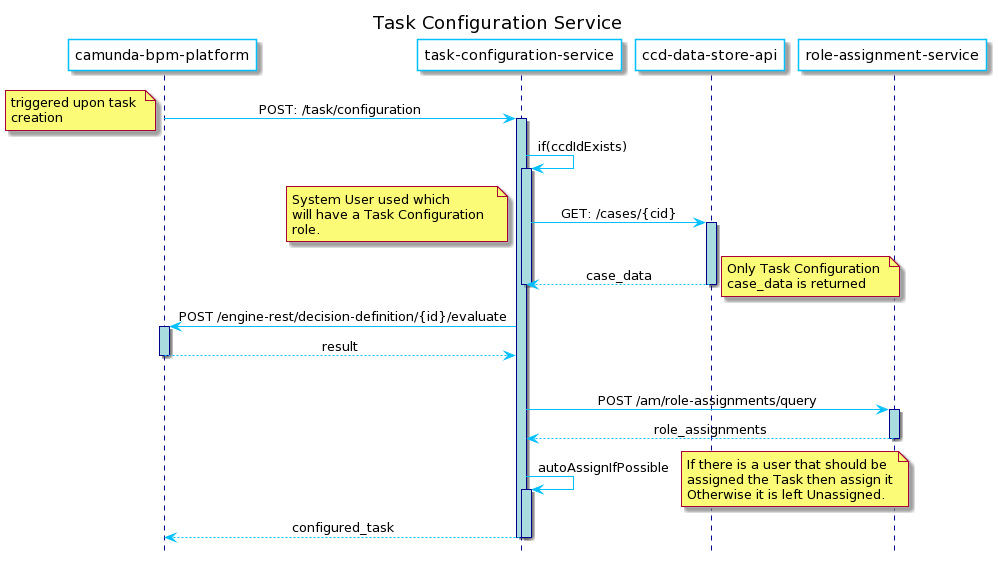

# wa-task-configuration-api

[](https://travis-ci.org/hmcts/wa-task-configuration-api)

#### What does this app do?

- Receives an unconfigured Task upon its creation
- Retrieves CCD case data for given caseId
- Evaluates DMN configuration and gets output variables
- Updates the Task, where the taskState values mean:
  - "unconfigured" means the task has not run though wa-task-configuration or failed when configuring the task.
  - "unassigned"  means a task has been run though the wa-task-configuration and did not have any pre-defined users to assign the task to so available to anyone
  - "assigned"  means the task has been run though the wa-task-configuration and had a pre-defined user to assign the task to. Or the task was claimed using the task management workflow.
- Auto-assigns the Task
- Responds with a Configured Camunda Task.

<!--
    Sequence Diagram Source:
    http://www.plantuml.com/plantuml/uml/fLDDJnin43tZNp6Yb_QmxBaS4E6Z5H8LI84pcjYpkrQyzcAF4oBWlzVUR0A9qgHLSt9cthnvC_FsF31wZgqHZLO4bNCySIz2XAcs7Nfi8JIet5pR6jX7siZGSoGh2Lx5qSXxDxzqndcu8kh6qyM5YPJYafs_S5wHNsOL-kcaJztgYcwrfGDPbDFQksZL4l5bzFtgykg7E197z-XPIzsXvO5Zk_y6PfjftcWc0SFl5uM0DOsChYr8ianUl0l1cWt10uOfN3fRwJfwPEqiZCdFj2GXCB93oNg6JE2iw3uwmh74DlN3OjArHMUGA-VRuqq89-v2VkOkmf9x2oYbAXGo5e6Tfm8xlGNmpgHm26c2bYolQG03U0n2YDrwYhDz8k0Kxk_63wTGPb2v0UgtPnqJ6Afus2LxNTVaIK7id8LS1KDAUlge8wlwsgHhJ__3wdJrLKfrewvVTE3mxG0T56SxLvc8VbxdAIK62kMhrEfzvtZZHM1guJ4HGWoaiezaivfmhes11cS4kCirArW-rSdc5lemSVGMieIdh4y8HIjlxNVAMgdNTREIUcVDOfUA8Rrk0peChKbjY3fucPr-6Xm39TbQMoey1IuLIHrojQ9AMvs9ojUquv9cQ28oYM7uX8w6XNXxUplKFhjwtGpRSki32ELp9ByG6LKaz3woq_uaJv-A_zEL6DcDUhQRwjwbnyJGxYlTLC0DUSfNm6mfd_uZGsXSD0ecDE2MsaXbT7_L_B136FJww9bihWEbKARCreL7kwe--OS3zrlxuurNDQIUCaVF-xTsFIUhOcj-0m00

    See: https://plantuml.com/ docs for reference
-->




## Building and deploying the application

### Building the application

The project uses [Gradle](https://gradle.org) as a build tool. It already contains
`./gradlew` wrapper script, so there's no need to install gradle.

To build the project execute the following command:

```bash
  ./gradlew build
```
This will do compilation, checkstyle, PMD checks , run tests , but not integration or functional tests.

### Running the application

- Prerequisite:
    - Install yarn
    ```
        yarn upgrade --latest
    ```
    - git clone git@github.com:hmcts/ia-ccd-definitions.git
    - change folder cd ia-ccd-definitions
    - Install needed yarn libs
        ```
            yarn install
        ```
    - Setup local repo for ccd-definition-processor
        ```
            yarn setup
        ```
    - Upload case definitions
        ```
            yarn upload-wa
        ```
- To run application, from IDE or command line
   ```
     ./gradlew bootRun
   ```
- In order to test if the application is up, you can call its health endpoint:
   ```
     http://localhost:8091/health
   ```

  You should get a response similar to this:

  ```
    {"status":"UP","diskSpace":{"status":"UP","total":249644974080,"free":137188298752,"threshold":10485760}}
  ```

- To run FT locally
    - Run ia-case-api
       ```
         ./gradlew bootRun
       ```
    - Run ia-case-notifications
       ```
         ./gradlew bootRun
       ```
    - Run wa-case-event-handler
       ```
         ./gradlew bootRun
       ```
    - Upload the ia-ccd-definition
      ```
         yarn upload-wa
      ```

    Note: If you see any environment variables missing, do source ~/.bash_profile.
          Make sure you have got the environment variables in bash_profile.

     - To run all tests including junit, integration and functional. You can run the command
        ```
            ./gradlew test integration functional
        ```
       or
        ```
            ./gradlew tests
        ```

    ### Running contract or pact tests:

    You can run contract or pact tests as follows:

    ```
    ./gradlew contract
    ```

    You can then publish your pact tests locally by first running the pact docker-compose:

    ```
    docker-compose -f docker-pactbroker-compose.yml up
    ```

    and then using it to publish your tests:

    ```
    ./gradlew pactPublish
    ```
## License

This project is licensed under the MIT License - see the [LICENSE](LICENSE) file for details

